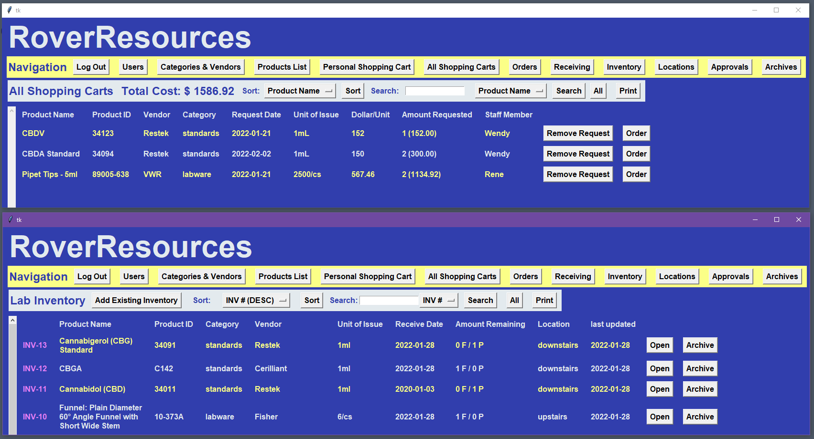
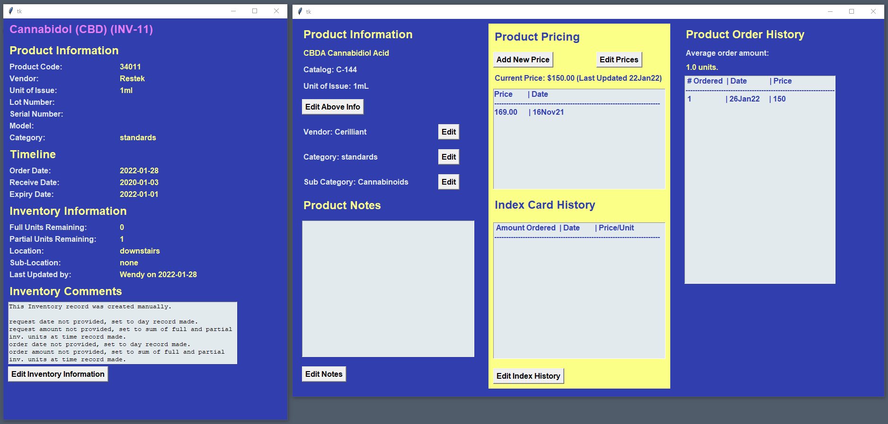
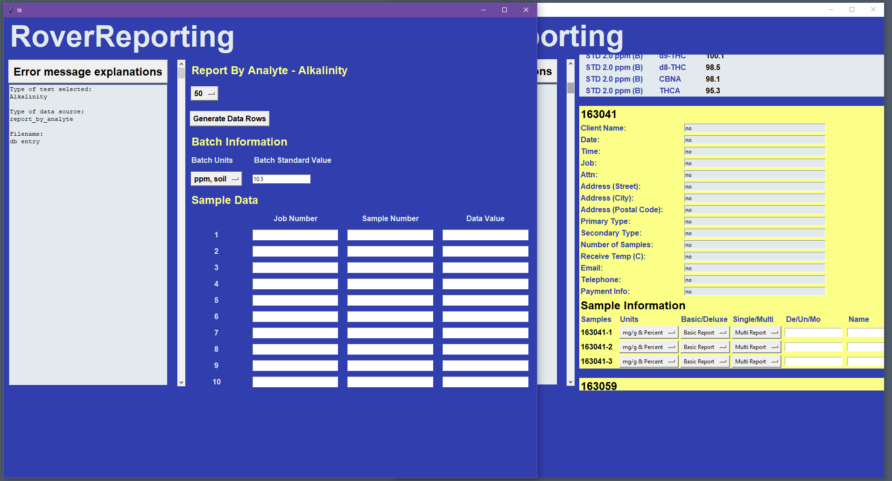
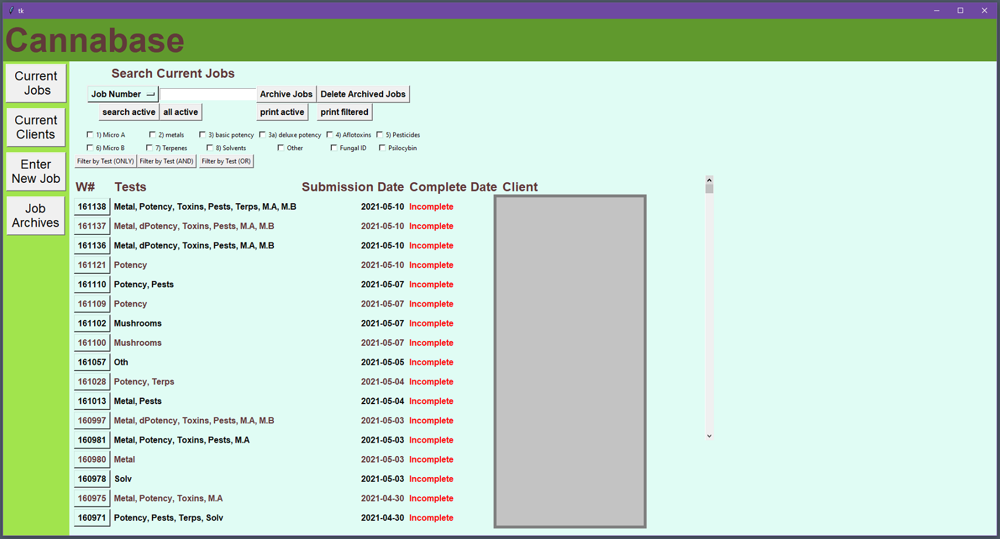
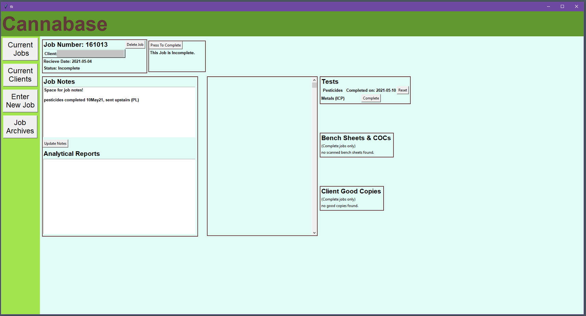

### [Chemistry Resume (.pdf)](Peter_Levett_Chemistry_Resume_04July2021.pdf)
last updated: July 2021
### [Software Resume (.pdf)](Peter_Levett_Programming_Resume_04July2021.pdf)
last updated: July 2021

# Projects

### [Rover Resources](https://github.com/StavromularBeta/RoverResources)
#### Python, SQL 
##### Tkinter, SQLite3, pandas, numpy, xlsxwriter, openpyxl 

software that tracks the ordering and inventory of standards, media, office supplies, general equipment, chemicals, lab-ware, and any other required items for an analytical chemistry laboratory.

Items received by the lab are ordered by individuals, confirmed by administrators from a shared shopping cart, and are tracked from request to reception. Individual inventory items contain a trail of information that accompanies their lifetime in the laboratory.

### [Rover Reporting](https://github.com/StavromularBeta/RoverReporting/tree/master)
#### Python, SQL, Latex
##### Tkinter, SQLite3, pandas, numpy, xlsxwriter, openpyxl

Create Analytical Chemistry reports by analytes. Allows for data import from .csv files based on sample numbers from many batches. Alternatively, create reports by batch for multiple analytes. Matches client metadata to analytical data to produce finished reports. This software was made for MB Laboratories Ltd.

Software allowed for increased throughput of samples in the laboratory. Examples of reports produced by software in a real world setting can be found at the following link - [the RoverReporting generated results are the potency, pesticides, and toxin results.](https://www2.gov.bc.ca/assets/gov/public-safety-and-emergency-services/public-safety/cannabis/mblabs-results.pdf)

### [Cannabase](https://github.com/StavromularBeta/Cannabase)
#### Python, SQL
##### Tkinter, SQLite3, pandas, numpy, win32api

Sample tracking database API built to handle incoming samples for testing as per Health Canada's requirements on legal cannabis products. Contains spaces for notes, sample photos, client information, and testing status updates. Basic reports generated by RoverReporting can be displayed on individual sample pages.

### [EasyTrax](https://github.com/StavromularBeta/EasyTrax)
#### Python
##### TKinter, pandas, numpy

EasyTrax is a python module that converts human-readable analytical reports into a delimited ASCII flat file. This file format (.WTX) is used to upload analytical data to the website WaterTrax. Several clients of the lab this software was produced for require their reports to be handled by WaterTrax. WaterTrax data can be entered by hand via a web client. This can be extremely tedious - for example, 12 sampling locations with 50 analytes each is 700 individual pieces of data that need to be hand-entered. EasyTrax files take seconds to create, and a minute to upload.

### [Symplify](https://github.com/StavromularBeta/Symplify)
#### Python

Symplify is a python library designed to work with the Symbiot workstation. It is coupled to a novel workstation setup and also requires the use of the PE Biosystems software. It allows you to make methods much faster than you could with the original software - allowing the user to bypass the original routine builder.

This software was written for the [Hore Group](http://web.uvic.ca/~dkhore/group.html), University of Victoria, Canada.

### [Victoria School Based Weather Station Network](https://www.victoriaweather.ca/about.php)

Developed weather station QC and error checking software for weather stations making up the Victoria School Based Weather Station Network, run by the School of Earth and Ocean Science at the University of Victoria.
